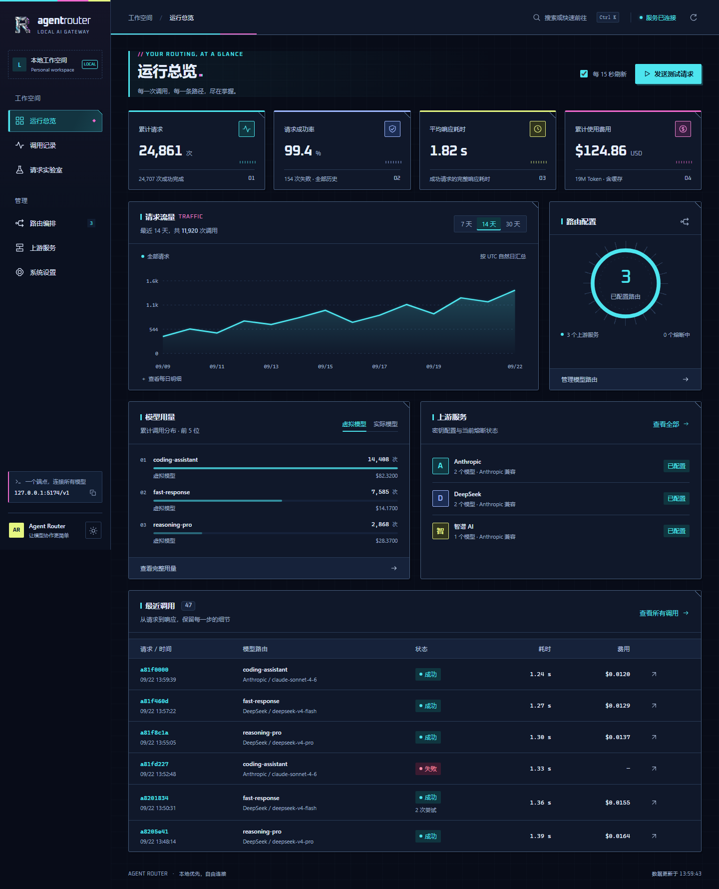

# Dashboard 使用说明

[返回 README](../README.md) · [配置参考](configuration.md) · [API 参考](api.md)

新版界面以「观察 → 定位 → 调整 → 验证」组织功能。所有页面连接同一组本地 API，生产界面没有演示数据回退或第三方字体请求。

侧栏品牌标识与浏览器图标采用机械 R Logo，使用银铬电镀质感与青紫反光，深浅主题共享透明背景图像。

界面统一使用 Provider 表示 API 服务连接，Router 表示客户端调用的虚拟模型映射；对应管理页面为 **Providers** 与 **Routers**。Router 名称就是请求中的 `model` 值，配置字段与 API 路径保持兼容。「自动故障转移」控制失败时是否继续尝试其他候选模型。

## 工作区

| 工作区 | 用途 |
| ------ | ------ |
| 运行总览 | 累计请求、成功率、完整响应耗时、费用、7 / 14 / 30 天请求趋势、模型用量和最近调用 |
| 调用记录 | 按虚拟模型、Provider、实际模型和状态筛选；分页、当前页 CSV 导出、执行明细、请求 / 响应正文与四类价格快照 |
| Routers | 可视化候选链、带目标位置预览和动画的拖动排序、固定模型、复制 Router，以及全局自动故障转移开关 |
| Providers | API 连接、模型目录、四类价格、并发 / 排队 / 超时设置，以及实时熔断重置 |
| 请求实验室 | 使用已发布 Router 发送真实请求；支持系统提示词、流式 / 非流式响应、停止请求、Token 与原始响应 |
| 系统设置 | 全局熔断、监听地址、日志轮转，以及已发布配置的脱敏 JSON 导出 |

## 第一次接入

1. 打开「Providers」，填写唯一名称、Messages API 兼容 Base URL 和 API Key。Base URL 不包含 `/v1/messages`。
2. 在 Provider 卡片中添加实际模型，名称必须与 Provider 接受的模型 ID 相同。可填写输入、输出、缓存读取和缓存写入价格，单位 USD / 1M Token。
3. 打开「Routers」，新建客户端调用的虚拟模型名称，从目录选择候选模型。
4. 拖动候选模型左侧的手柄调整优先级：拖动时显示目标位置，松开后以动画完成排序，按 Esc 可取消。也可用上下按钮或聚焦手柄后按上下方向键调整。选择固定模型后，「自动故障转移」开关开启时按候选顺序故障转移；关闭时仅请求固定模型，报错直接返回，不尝试备用 Provider。没有固定模型时自动选中第一个候选。开关更改也保存在草稿中，需要「检查并发布」后生效，对普通和流式请求都有效。
5. 点击底部「检查并发布」。发布成功后，在「请求实验室」选择该 Router 发送测试请求。
6. 在「调用记录」查看最终模型、Provider 尝试、耗时和费用。请求 / 响应正文默认不记录；排障时可在「系统设置」限时开启。

关闭自动故障转移时，Provider 错误按原始状态码与正文返回；具体错误头、流式和本地错误语义见 [API 参考](api.md#路由模式与错误)。

Provider 名称与已登记的实际模型名称保持只读。要迁移名称，请新增目录项、更新 Router 引用，再删除旧项，一次发布完成。Router 名称可编辑，也可复制后调整。

## 草稿与发布

配置编辑不会立即改变运行时。草稿跨页面保留，但不保存到磁盘或浏览器存储。刷新、关闭浏览器可能丢失未发布编辑，浏览器会先提示。关闭尚未应用的编辑弹窗也会确认放弃。

发布前会检查端口、超时、价格、模型引用、重复候选和固定模型等，再比较服务器配置快照。发生外部修改时会保留草稿并阻止发布。用户可继续查看本地调整，或放弃草稿重新载入。后端没有原子版本锁，极短时间内的并发 GET / PUT 仍需调用方协调。

密钥输入框留空会保留已保存的密钥；更换已有 Provider 密钥时必须输入完整值，新的星号脱敏占位符会被拦截，避免误报更新成功。新 Provider 需要填写密钥，也支持 `${ENV_VAR}`。密钥不写入 localStorage；只有主题偏好会在浏览器中保存。发布成功即清除内存中刚提交的明文密钥，再读取后端脱敏值；重新读取失败时会提示已保存，不会把已提交内容标为未保存。

删除 Provider 或实际模型前会显示受影响 Router。确认后删除对应候选，固定模型失效时按当前策略处理，没有候选的 Router 一起移除，允许显式删除至空配置；发布后生效。每张 Provider 卡片右上角的重置按钮会同时清除熔断状态与限流冷却，直接作用于运行时，并单独确认；即使只有限流冷却、没有熔断告警，也可使用。

监听地址与端口在发布后保存，下次重启服务才生效。其他路由、连接和日志设置由后端热重载。

配置与运行数据默认保存在 `~/.routelet/`，从不同目录启动共用同一份数据。日志路径与留空处理等规则见 [运行与维护](operations.md#数据目录与路径)。系统设置可导出已发布配置的脱敏 JSON。

「系统设置」中的调用正文记录开关直接作用于运行时，无需发布。开启前会再次提示正文可能含敏感内容、响应记录会显著增大数据库；可选 15 分钟至 24 小时，到期或重启后自动关闭，也可立即关闭。关闭不会删除已有正文。

## 读懂数据

- 总览统计和模型排行是数据库中保留的全部历史数据，7 / 14 / 30 天只控制流量趋势。
- 趋势按 UTC 日期聚合，无调用日期补零。展开「每日明细」可通过表格读取同一组数据。
- 平均耗时只统计成功请求的完整响应时长，不等同于首 Token 延迟。
- 累计 Token 包含输入、输出与两类缓存；费用使用调用时的价格快照。
- `—` 表示缺失或无法表示的数据；调用的四类 Token 全部缺失时也显示 `—`，至少一项有值时才合计，已知零用量显示 `0`。价格 `$0.0000` 表示显式零值。未配置价格计费按 [价格规则](configuration.md#实际模型与虚拟模型) 处理。
- 「已配置」表示存在密钥和目录配置，不等于实时 Provider 健康检查。当前熔断状态来自后端。
- 调用详情会忽略损坏的历史故障转移条目，保留其他有效条目。流式调用可能没有持久化响应正文。
- 调用列表支持 20 / 50 / 100 条分页，CSV 仅导出当前页摘要，不包含正文。

调用时间按浏览器本地时区显示。监控默认每 15 秒刷新，浏览器页面隐藏时暂停，同批请求不重叠；可以在总览关闭自动刷新。调用筛选记录在 URL 中，模型身份使用独立字段，所以模型或 Provider 名称包含 `/` 也不会混淆；旧请求的响应不会覆盖新筛选。

Providers 和 Routers 页面的搜索词也记录在 URL 中，复制链接或使用浏览器前进、后退时会恢复对应筛选。

连接状态仅由健康检查决定。统计、调用记录与熔断状态分别更新：部分接口失败时保留该项旧数据并标明失败项，其他可用数据照常刷新。熔断重置支持包含 `/` 的 Provider 名称，API 路径中的名称需进行 URL 编码，例如 `POST /api/circuit-breaker/a%2Fb/reset`。

## 请求实验室

实验室使用已发布配置，草稿修改要先发布。请求支持系统提示词、用户消息、最大输出 Token 和流式开关。发送会产生真实 Provider 调用与费用。

流式输出按完整 SSE 事件和 UTF-8 字节解码，支持 LF、CRLF 与裸 CR 换行及跨网络块的分隔符；支持查看原始事件，错误或未收到结束事件会显示失败。点击停止或离开页面会取消等待并保留本次已收到的内容，最长等待为 180 秒。原始流预览仅保留约 120,000 字符，正文按接收结果显示；实验室不在本地存储对话。

HTTP 请求失败时，实验室与面板其他页面使用相同的错误详情解析规则，并在原始响应区域保留服务返回的正文。

## 快捷键与外观

| 操作 | 快捷键 |
| --- | --- |
| 搜索页面、Router、Provider | Ctrl / ⌘ + K |
| 检查未发布配置 | Ctrl / ⌘ + S |
| 关闭弹窗 | Esc |
| 在搜索结果中选择 / 打开 | ↑ / ↓ / Enter |

侧栏底部可切换明暗主题、复制当前同源 API 端点。手机使用左上角菜单，宽表格可左右滚动。弹窗支持键盘焦点约束、滚动锁定和关闭后焦点恢复。减少动态效果的系统偏好会被尊重。

两套主题共享赛博朋克视觉：技术字体、切角面板、细网格和线框控件。浅色使用明亮底色与青、品红、电黄点缀；深色使用深蓝黑背景和霓虹强调色，保留相同布局与控件外观。标题和数字使用随项目打包的 Oxanium 字体（SIL OFL 许可），中文正文使用系统字体，运行时无需访问外部字体服务。装饰不使用持续闪烁动画。

## 相关文档

前端安装、开发服务器、单元测试、浏览器测试和构建命令统一见 [开发指南](development.md)。页面分层、状态管理、轮询与流式解析的实现见 [架构设计](design.md)。

## 界面预览

以下均为模拟数据，不代表真实调用量、服务健康或 Provider 报价。

