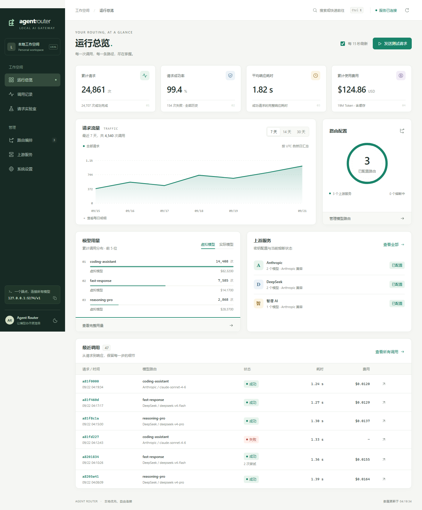
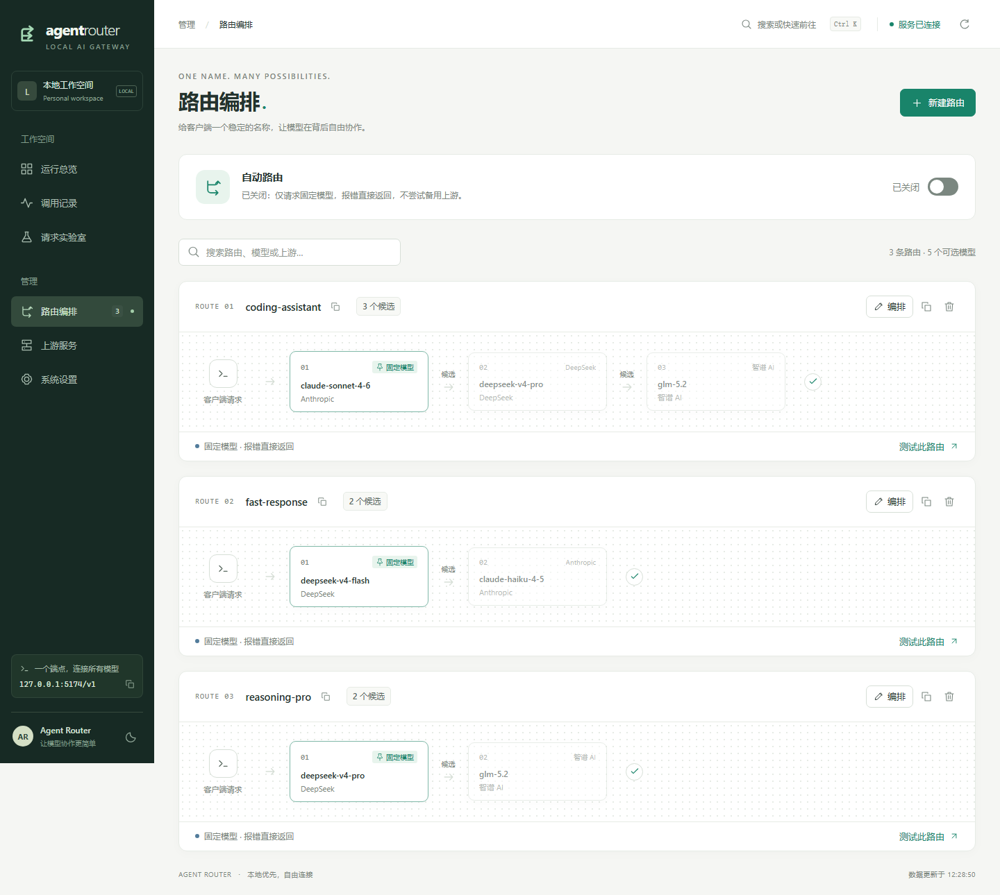
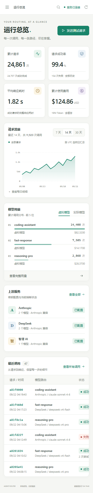

# Dashboard 工作台

新版界面以「观察 → 定位 → 调整 → 验证」组织功能。所有页面连接同一组本地 API，生产界面没有演示数据回退或第三方字体请求。

## 第一次接入

1. 打开「上游服务」，填写唯一名称、Anthropic 兼容 Base URL 和 API Key。Base URL 不包含 `/v1/messages`。
2. 在上游卡片中添加实际模型，名称必须与上游接受的模型 ID 相同。可填写输入、输出、缓存读取和缓存写入价格，单位 USD / 1M Token。
3. 打开「路由编排」，新建客户端调用的虚拟模型名称，从目录选择候选模型。
4. 用上下按钮调整优先级，选择固定模型。「自动路由」开关开启时按候选顺序故障转移；关闭时仅请求固定模型，报错直接返回，不尝试备用上游。没有固定模型时自动选中第一个候选。开关更改也保存在草稿中，需要「检查并发布」后生效，对普通和流式请求都有效。

关闭自动路由后的上游 HTTP 错误会保留原始状态码、完整正文和必要错误响应头（如 `Retry-After`），SSE error 事件也不再重新包装。没有收到上游错误响应时（如连接超时、本地熔断），仍返回 Router 自身的错误。
5. 点击底部「检查并发布」。发布成功后，在「请求实验室」选择该路由发送测试请求。
6. 在「调用记录」查看最终模型、上游尝试、耗时、费用和请求 / 响应正文。

上游名称与已登记的实际模型名称保持只读。要迁移名称，请新增目录项、更新路由引用，再删除旧项，一次发布完成。路由名称可编辑，也可复制后调整。

## 草稿与发布

配置编辑不会立即改变运行时。草稿跨页面保留，但不保存到磁盘或浏览器存储。刷新、关闭浏览器可能丢失未发布编辑，浏览器会先提示。关闭尚未应用的编辑弹窗也会确认放弃。

发布前会检查端口、超时、价格、模型引用、重复候选和固定模型等，再比较服务器配置快照。发生外部修改时会保留草稿并阻止发布。用户可继续查看本地调整，或放弃草稿重新载入。后端没有原子版本锁，极短时间内的并发 GET / PUT 仍需调用方协调。

密钥输入框留空会保留已保存的密钥。新上游需要填写密钥，也支持 `${ENV_VAR}`。密钥不写入 localStorage；只有主题偏好会在浏览器中保存。发布成功即清除内存中刚提交的明文密钥，再读取后端脱敏值。

删除上游或实际模型前会显示受影响路由。确认后删除对应候选，固定模型失效时按当前策略处理，没有候选的路由一起移除；发布后生效。熔断「重置」直接作用于运行时，会单独确认。

监听地址与端口在发布后保存，下次重启服务才生效。其他路由、连接和日志设置由后端热重载。

## 读懂数据

- 总览统计和模型排行是全部历史数据，7 / 14 / 30 天只控制流量趋势。
- 趋势按 UTC 日期聚合，无调用日期补零。展开「每日明细」可通过表格读取同一组数据。
- 平均耗时只统计成功请求的完整响应时长，不等同于首 Token 延迟。
- 累计 Token 包含输入、输出与两类缓存；费用使用调用时的价格快照。
- `—` 表示缺失或无法表示的数据；价格 `$0.0000` 表示显式零值。未配置价格计费按后端规则处理。
- 「已配置」表示存在密钥和目录配置，不等于实时上游健康检查。当前熔断状态来自后端。
- 调用详情会忽略损坏的历史故障转移条目，保留其他有效条目。流式调用可能没有持久化响应正文。
- 调用列表支持 20 / 50 / 100 条分页，CSV 仅导出当前页摘要，不包含正文。

监控默认每 15 秒刷新，浏览器页面隐藏时暂停；可以在总览关闭自动刷新。调用筛选记录在 URL 中，模型身份使用独立字段，所以模型或上游名称包含 `/` 也不会混淆。

## 请求实验室

实验室使用已发布配置，草稿修改要先发布。请求支持系统提示词、用户消息、最大输出 Token 和流式开关。发送会产生真实上游调用与费用。

流式输出按完整 SSE 事件和 UTF-8 字节解码；支持查看原始事件，错误或未收到结束事件会显示失败。点击停止或离开页面会取消等待并保留本次已收到的内容，最长等待为 180 秒。原始流预览仅保留约 120,000 字符，正文按接收结果显示；实验室不在本地存储对话。

## 快捷键与外观

| 操作 | 快捷键 |
| --- | --- |
| 搜索页面、模型路由、上游 | Ctrl / ⌘ + K |
| 检查未发布配置 | Ctrl / ⌘ + S |
| 关闭弹窗 | Esc |
| 在搜索结果中选择 / 打开 | ↑ / ↓ / Enter |

侧栏底部可切换明暗主题、复制当前同源 API 端点。手机使用左上角菜单，宽表格可左右滚动。弹窗支持键盘焦点约束、滚动锁定和关闭后焦点恢复。减少动态效果的系统偏好会被尊重。

## 开发与验证

```bash
cd dashboard
bun install --frozen-lockfile
bun run dev
bun test
bun x playwright install chromium
bun run test:e2e
bun run build
bun run format
```

前端单元测试位于 `dashboard/tests/`，Playwright 流程测试位于 `dashboard/e2e/`；`bunfig.toml` 将 bun:test 限定在单元测试目录，避免误执行浏览器测试。浏览器测试启动 127.0.0.1:5174 并拦截 API，所有配置、费用和请求都是测试数据。CI 安装 Chromium 并执行两个测试层。

代码分为 `pages`、`ui`、`domain`、`state`、`services` 和 `composables`。图表采用原生 SVG，页面按路由拆分加载，无 ECharts 运行时依赖。后端 API、配置 schema 与配置示例保持兼容。

## 界面预览

以下均为模拟数据，不代表真实调用量、服务健康或上游报价。






